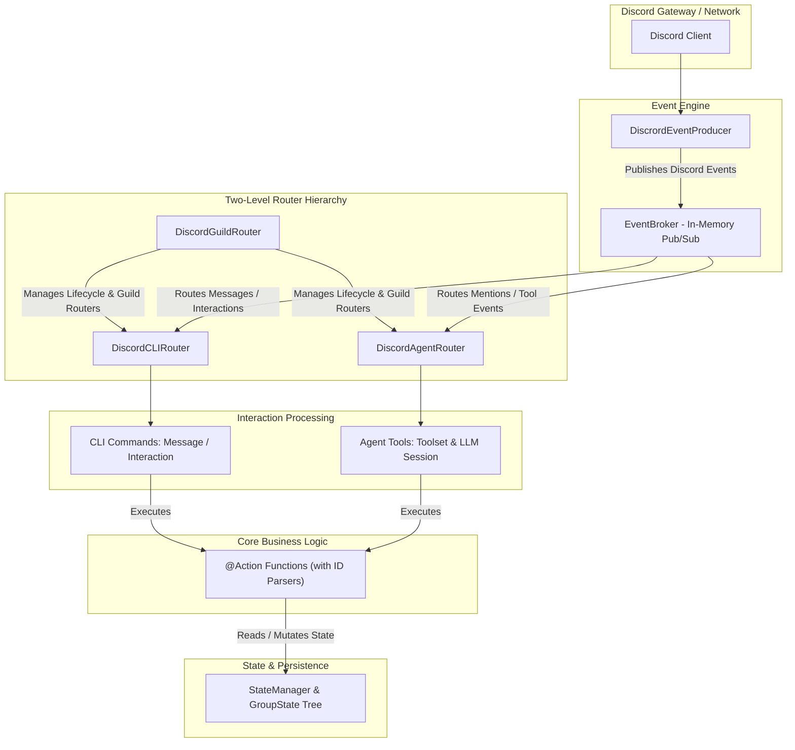

# Agentic Discord Bot

An agentic Discord bot supporting dual interaction models:
1. **CLI Flow**: Traditional slash commands (`/play`, `/search`, etc.) and message prefix commands (`>play`, etc.).
2. **Agentic Flow**: Tag-driven conversational AI agent utilizing tool calling to fulfill complex user requests (with voice conversation support in future iterations).

## System Architecture & Interaction Flow



### Core Architecture Components
- **Actions (`discord_bot/actions/`)**: Flow-agnostic core functions decorated with `@Action`. They encapsulate business logic and feature automatic string-to-Discord-object ID parsing.
- **Routers (`discord_bot/routers/`)**: Two-level event routing layer:
  - Top-level `DiscordGuildRouter` manages multi-guild lifecycle and dynamically initializes local server routers.
  - Local `Router` instances handle guild-specific events, CLI commands, and Agent LLM sessions.
- **State Manager (`discord_bot/routers/state_manager.py`)**: Asynchronous, locked hierarchical state container (`GroupState`) for persisting per-guild and per-feature runtime states.
- **Event Broker (`discord_bot/events/`)**: In-memory pub/sub event system decoupling event producers from router handlers. Note: `broker: EventBroker` is explicitly passed throughout the codebase rather than relying on global state access.

For detailed development guidelines for AI agents, see [AGENTS.md](AGENTS.md).

## Subsystem Documentation

- [Actions Directory](discord_bot/actions/README.md)
- [Routers Directory](discord_bot/routers/README.md)
- [CLI Commands](discord_bot/routers/discord_cli/commands/README.md)
- [Agent Tools](discord_bot/routers/discord_agent/tools/README.md)
- [Events System](discord_bot/events/README.md)

## Development Setup

Initialize environment:
```bash
conda env create -f manifest.yaml
```

Update environment:
```bash
conda env update -f manifest.yaml --prune
```

Run locally:
```bash
conda activate agent_bot
python -m discord_bot
```
